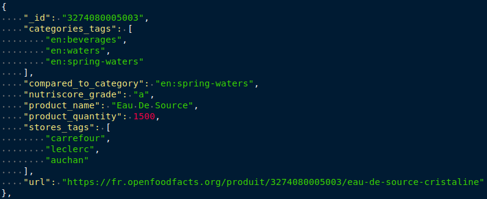
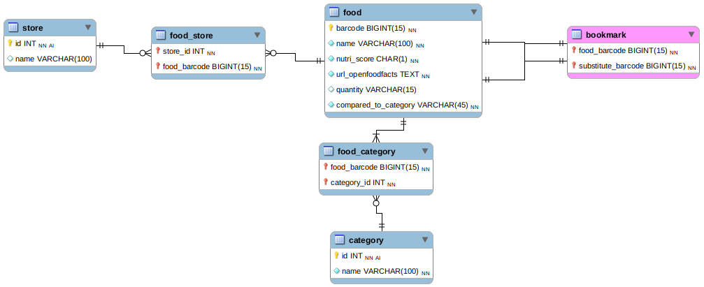

====================
"Pur Beurre" project
====================
**Searching for food substitution in Open Food Facts french database**

*****************
TABLE OF CONTENTS
*****************

1. `DESCRIPTION`_
2. `INSTALLATION`_
3. `USAGE`_
4. `ROADMAP`_
5. `LICENSE`_
6. `PROJECT STATUS`_

DESCRIPTION
===========
This program asks the user for choosing a food product in the database and searches for an healthy alternative.
It proposes selecting a category then a food product.

Data comes from Open Food Facts (OFF) french database. The program requests the OFF search API
then inserts the retrieved json data in a local database.

The program allows the user to back up his favorite food substitution in the database to read it later.

Features
------------

I. A user would like to choose a food product in order to obtain an healthy substitution.

    I.1 Load data :
        I.1.1 Retrieve OFF data using search API requests (get_off_api_data() in /Data_loading/retrieve_off_api_data.py) with the "fields" keyword
        to get only needed infos in the responses (see the picture 1_food_product.json_).

        I.1.2 Parse the responses stored in a json object to build one list with all valid food products (have all the required fields) (build_list_of_all_valid_products() in /Data_loading/retrieve_off_api_data.py).

        I.1.3 Translate categories (often in english) and keep only some chosen categories to fill the table in database (select_and_translate_products_categories() in /Data_loading/retrieve_off_api_data.py).

        I.1.4 Fill the database (db_insert_all_products() in /Data_loading/fill_pur_beurre_db.py) with the list obtained step I.3.

    I.2 User Interface : Propose searching for a food product substitute (see I.2) OR displaying recorded favorites (see III).
        I.2.1 Display numbered food products categories and ask user for choosing one. Then display numbered food products
        (belonging to the chosen category) and propose choosing one or going back to the categories choice.

        I.2.2 Compare the chosen food products to those having the same category(ies) to find a substitution (i.e with nutriscore <).

        I.2.3 Display the result : infos about the food product to be substituted --> infos about the substitute.

II. A user would like to back up a food product substitution in order to keep it in memory as a favorite.

        * When a substitution result is display (see I.2.3), propose recording it in the database.

III. A user would like to get back his food product substitution favorites in order to read informations without repeating the research.

        * III.1 Display recorded substitution results (infos about the food product to be substituted --> infos about the substitute).

INSTALLATION
============
1) Install MySQL SGDB + Modify DB_PARAM dict (in config.py) to replace it with your database connection parameters.
2) Create the database : execute /Data_loading/pur_beurre_db_creation.sql.
3) Run : main.py [-h] ld

Requirements
------------
|vPython badge| |vMySQL badge|

Python librairies (see requirements.txt):

* certifi==2020.12.5
* chardet==4.0.0
* idna==2.10
* mysql-connector-python==8.0.23
* pkg-resources==0.0.0
* protobuf==3.14.0
* requests==2.25.1
* six==1.15.0
* urllib3==1.26.3

USAGE
=====

.. _1_food_product.json:

------------------------------------------------------------------------------------------------------------------------

**Each field in json format corresponds to one in the local database (see local_db_schema_ below):**

Table food :

* "_id" = barcode
* "product_name" = name
* "nutriscore_grade" = nutri_score
* "url" = url
* "product_quantity" (optional) : quantity
* "compared_to_categroy" = compared_to_category --> the unique keyword used to find a relevant substitute.

Table category : 1 element in the "categories_tags" = name

Table store : 1 element in the "stores_tags" (optional) = name

------------------------------------------------------------------------------------------------------------------------

**Pur Beurre Food substitution application local database :**

.. _local_db_schema:

ROADMAP
=======

LICENSE
=======

PROJECT STATUS
==============

.. |vPython badge| image:: https://img.shields.io/badge/python-v3.8-blue.svg
.. |vMySQL badge| image:: https://img.shields.io/badge/MySQL-v5.7-yellow

