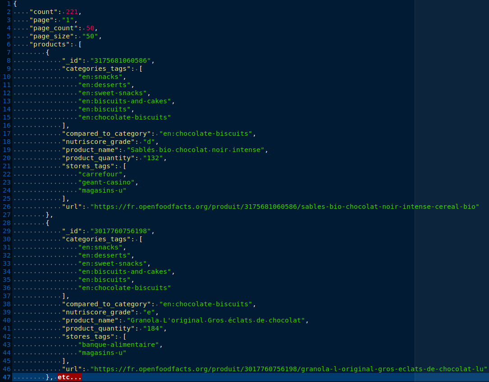

====================
"Pur Beurre" project
====================
**Searching for food substitution in Open Food Facts french database**

*****************
TABLE OF CONTENTS
*****************

1. `DESCRIPTION`_
    * `Features`_

2. `INSTALLATION`_
    * `Database installation`_
    * `Application`_
    * `Requirements`_

3. `USAGE`_
    * `json data examples`_
    * `Database`_
    * `OFF Search API query`_  
        1) Default usage
        2) Personalized usage

DESCRIPTION
===========
This program asks user for choosing a food product in a local database and searches for an healthy alternative.
The user could back up each result in the local database to read it later.

Data in local database comes from Open Food Facts (OFF) french database (requested via the OFF search API). The retrieved json
data are parsed, reorganized and inserted in the local database.

Features
--------
I. A user could choose a food product in order to obtain an healthy substitution (Main menu choice 1-).

    I.1 Load data :
        I.1.1 Requests the OFF search API (see response.json_).

        I.1.2 Reorganized json responses (see valid_product.json_):

            * Keeps only products dictionaries and makes one list with all of them valid (= has the required fields).
            * Selects and translates categories (often in english in OFF search API responses).

        I.1.3 Inserts in the local database (see Installation section below for more information).

    I.2 User Interface (terminal) :

        I.2.1 Display numbered food products categories and ask user for choosing one. Then display numbered food
        products (belonging to the chosen category) and propose choosing one or going back to the categories choice.

        I.2.2 Compare the chosen food products to those having the same "compared_to_category" field to find a substitution
        (i.e with a better Nutri-Score).

        I.2.3 Display the substitution results : infos about the substituted food product and infos about the substitution food(s) found.

II. A user could back up a food product substitution in order to keep it in memory as a favorite.

        * User Interface (terminal) : when substitution results are displayed (see I.2.3), it proposes for recording in the database.

III. A user could get back his food product substitution favorites in order to read information without
repeating the research (Main menu choice 2-).

        * User Interface (terminal) : displays recorded substitution resumed results and it proposes for displaying more infos about one of them.

INSTALLATION
============

Database installation
---------------------

1) Install MySQL SGDB and then modify DB_PARAM dict (in config.py) to replace it with your database connection parameters.
2) Create the database by executing database_managers/pur_beurre_db_creation.sql (see Physical Data Model local_db_PDM_).

Application
-----------

1) Download the project : use the "Code" (green button) and unzip the P5_PurBeurre-Food-Substitution_DA-Python-master/
2) Python3 comes with Python Package Manager (pip) else you have to install it (https://pip.pypa.io/en/stable/installing/)

3) Set up a virtual environment :

    NB: the symbol $ flags the commands prompt

    * UNIX operating system :
        3.1) Install the Python module : $ pip install venv

        3.2) Navigate to the project main directory using command prompt : $ cd .....
        
        3.3) Create a virtual environment : $ python -m venv name_of_your_virtual_env
        
        3.4) Activate the virtual environment : $ source name_of_your_virtual_env/bin/activate
        
    * DOS operating system :
        
        3.1) Install the Python module : $ pip install venv
        
        3.2) Navigate to the project main directory using command prompt : $ cd .....
        
        3.3) Create a virtual environment : $ py -m venv name_of_your_virtual_env
        
        3.4) Activate the virtual environment : $ .\name_of_your_virtual_env\Scripts\activate
        

4) Install required libraries :
    * using the provided text file : $ pip install -r requirements.txt
    * OR install manually each Python package (see Requirements section below)
  
5) Run the code source main.py file : (UNIX) python ./main.py (DOS) py main.py

    ↳ Usage: [-h|--help] [-ld|--load_data] [-p|--page PAGE] [-v|--verbose]

Requirements
------------
|vPython badge| |vMySQL badge|

Python libraries (see requirements.txt):

* certifi==2020.12.5
* chardet==4.0.0
* idna==2.10
* mysql-connector-python==8.0.23
* pkg-resources==0.0.0
* protobuf==3.14.0
* requests==2.25.1
* six==1.15.0
* urllib3==1.26.3

USAGE
=====
json data examples
------------------
**OFF search API response structure :**

.. _response.json:

|

**Final list of valid products dict structure :**

(after reorganization, see feature I.1.2)

.. _valid_product.json:

Database
--------

**Each json field (see picture above) corresponds to one in the local database:**

see local_db_PDM_ below

Table 'food' :

* "_id" = barcode
* "product_name" = name
* "nutriscore_grade" = Nutri-Score
* "url" = url
* "quantity" = quantity (optional field, used to specify some food product having same name but different barcode because of different quantity).
* "compared_to_category" = compared_to_category (unique keyword used to find a relevant substitution food).

Table 'category' : 

* "categories_tags" = list where each element is a row in the table (name field)

Table 'store' :

* "stores_tags" = list where each element is a row in the table (name field)

**Local database :**

.. _local_db_PDM:

OFF Search API query
--------------------
Documentation : https://documenter.getpostman.com/view/8470508/SVtN3Wzy#58efae40-73c3-4907-9a88-785faff6ffb1

1) About default usage in this program
~~~~~~~~~~~~~~~~~~~~~~~~~~~~~~~~~~~~~~
GET query parameters (only those used in this program) :
    * Country code : to filter the product search by country (after the https:// )
    * json : True to retrieve json format data file
    * page_size : products per page (seems to be 24 if not provided).
    * page : the number of the gotten page (1 if not provided).
    * field : to filter the product fields in the response
    * tagtype_X : to filter the product by criteria
    * tag_contains_X : to include or exclude the associated criterion ('contains' or 'does_not_contain')
    * tag_X: criterion

Default execution = 7 GET queries to the OFF search API (see dataoff/off_api_data.py and config.py) :
    * Country code = fr
    * json = True
    * page_size = 50
    * page = 1
    * fields = _id, product_name, nutriscore_grade, url, stores_tags, categories_tags, product_quantity, compared_to_category
    * tagtype_X = categories
    * tag_contains_X = contains
    * tag_X = see GET_QUERY_LIST_CATEGORIES_DICT in config.py

GET query example :
    * https://fr.openfoodfacts.org/cgi/search.pl?action=process&tagtype_0=categories&tag_contains_0=contains&tag_0=desserts&tagtype_1=categories&tag_contains_1=contains&tag_1=biscuits&fields=_id,product_name,nutriscore_grade,url,stores_tags,categories_tags,compared_to_category,product_quantity,&page_size=50&json=true

2) To personalize your usage
~~~~~~~~~~~~~~~~~~~~~~~~~~~~
2 ways :

    1) Modify variables directly in python scripts (see off_api_data.py, config.py) to get different data from OFF search API.

        *↪ For example : modify categories names in config.py or the gotten page number default value in get_run_args() in foodsubstitution/views/data_init_view.py.*

    2) Use the -p argument when running the program (see --help).

**WARNING :** do not modify the GET query 'fields' parameter values which corresponds to the database fields EXCEPT IF you would like to modify the database schema.

**Note that** IntegrityError (i.e duplicate primary key or value in UNIQUE constrained field) are handled during database insertions to enable "feeding" the local database with more products without crashing...

.. |vPython badge| image:: https://img.shields.io/badge/python-v3.8-blue.svg
.. |vMySQL badge| image:: https://img.shields.io/badge/MySQL-v5.7-yellow

